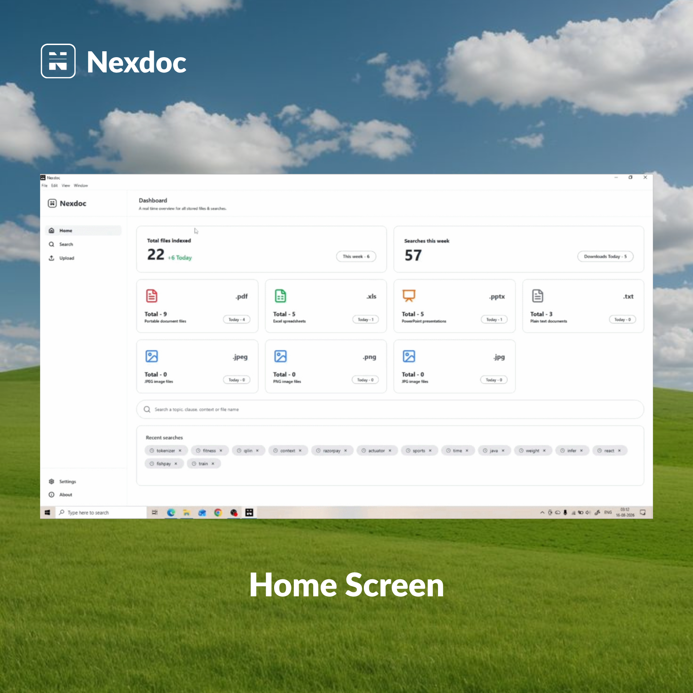
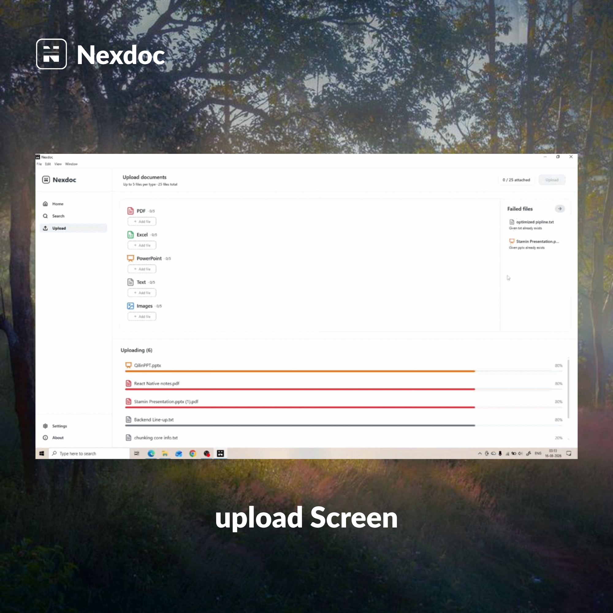

<p align="center">
  
</p>

# Nexdoc

### 🧠 Offline AI-Powered Document Intelligence & Search Engine

Nexdoc is a **high-performance offline document search system, its intelligent backend** designed to process multiple document formats, extract and clean their content, generate semantic embeddings, store searchable document data in LanceDB, and provide fast, context-aware search.

The backend follows a **modular layered architecture** with a threaded processing pipeline, dynamic worker pool, file watching, semantic retrieval, hybrid filtering, ranking, and optional AI-powered responses.

---

**Document Search & AI-Powered Results**

This application demonstrates Nexdoc's complete offline document intelligence workflow, including multi-format document upload, real-time processing status, semantic search across indexed documents, and AI-powered contextual answers. It serves as a demonstration client for firms evaluating Nexdoc before deploying it as their offline document assistant.

<br />
<br />

<p align="center">
  &nbsp;&nbsp;&nbsp;&nbsp;
  
</p>

<p align="center">
  &nbsp;&nbsp;&nbsp;&nbsp;
  
</p>

---

**Search & Retrieval**

Every query runs through semantic vector search, hybrid filtering, and result ranking before returning results — either as raw ranked matches in offline mode or as a synthesized AI answer with cited sources in AI mode.

**Document Insights**

Users can inspect file metadata, processing status, and topic extraction for each indexed document, giving full visibility into how Nexdoc understands and organizes their files.

---

## 📑 Table of Contents

- [Features](#-features)
- [How It Works](#-how-it-works)
- [System Design](#️-system-design)
- [Project Structure](#-project-structure)
- [Tech Stack](#️-tech-stack)
- [Document Processing Pipeline](#️-document-processing-pipeline)
- [Search Pipeline](#-search-pipeline)
- [Storage Architecture](#️-storage-architecture)
- [Layered Architecture](#-layered-architecture)
- [Processing Characteristics](#-processing-characteristics)
- [Edge Cases & Reliability](#️-edge-cases--reliability)
- [Privacy & Offline Architecture](#-privacy--offline-architecture)
- [Setup](#-setup)
- [API Modules](#-api-modules)
- [Desktop Packaging](#-desktop-packaging)
- [Current Status](#-current-status)
- [Future Improvements](#-future-improvements)
- [Design Principles](#-design-principles)
- [Author](#-author)

---

## ✨ Features

### 📂 Multi-Format Document Support
- PDF
- Images (OCR-based)
- PPTX
- TXT
- XLS / XLSX

### ⚡ High-Performance Processing
- Multi-threaded document processing
- Dynamic worker pool based on available CPU cores
- Producer-consumer processing pipeline
- Real-time file detection using Watchdog
- Concurrent file processing
- Processing status tracking

### 🧠 Document Intelligence
- Text extraction
- Text cleaning and normalization
- Sentence-aware chunking
- Topic extraction
- File metadata extraction
- Semantic embeddings using Sentence Transformers

### 🔍 Advanced Search
- Semantic vector search
- Hybrid filtering
- Result ranking
- Context-aware retrieval
- Offline search mode
- AI-powered search mode

### 📦 Efficient Storage
- LanceDB vector database
- Vector embeddings stored with document metadata
- SQLite-based application data storage
- Persistent local storage
- Metadata-based document retrieval

### 📴 Offline-First Architecture
- Local document processing
- Local embedding generation
- Local vector database
- No cloud backend required for core document processing and search
- Designed for privacy-focused desktop usage

### 🤖 Optional AI Mode
- AI-powered query responses
- Relevant document sources returned with AI answers
- Gemini API integration for AI-assisted responses
- Offline mode remains available without AI services

---

## 🧠 How It Works

```text
User Upload
     ↓
File Storage
     ↓
File Watching
     ↓
Queue
     ↓
Dynamic Worker Pool
     ↓
File Processing
     ↓
Text + Metadata Extraction
     ↓
Text Cleaning
     ↓
Chunking
     ↓
Embedding Generation
     ↓
LanceDB Storage
     ↓
Search
     ↓
Hybrid Filtering
     ↓
Ranking
     ↓
Offline / AI Response
```

---

## 🏗️ System Design

Nexdoc uses a **producer-consumer architecture** for document processing. Uploaded files are placed into a processing queue and consumed by dynamically created workers. The worker pool determines its capacity from the available CPU resources, allowing the backend to adapt to different machines.

Each worker independently processes a document through extraction, cleaning, chunking, embedding generation, and LanceDB persistence — while the main application remains responsive.

```text
                         ┌──────────────────┐
                         │   User Uploads   │
                         └────────┬─────────┘
                                  │
                                  ▼
                         ┌──────────────────┐
                         │   File Storage   │
                         └────────┬─────────┘
                                  │
                                  ▼
                         ┌──────────────────┐
                         │  File Watcher    │
                         └────────┬─────────┘
                                  │
                                  ▼
                         ┌──────────────────┐
                         │ Processing Queue │
                         └────────┬─────────┘
                                  │
                    ┌─────────────┴─────────────┐
                    │                           │
                    ▼                           ▼
              ┌──────────┐                ┌──────────┐
              │ Worker 1 │                │ Worker N │
              └────┬─────┘                └────┬─────┘
                   │                           │
                   └─────────────┬─────────────┘
                                 │
                                 ▼
                        ┌──────────────────┐
                        │ File Processing  │
                        └────────┬─────────┘
                                 │
                                 ▼
                        ┌──────────────────┐
                        │ Text + Metadata  │
                        └────────┬─────────┘
                                 │
                                 ▼
                        ┌──────────────────┐
                        │ Text Cleaning    │
                        └────────┬─────────┘
                                 │
                                 ▼
                        ┌──────────────────┐
                        │    Chunking      │
                        └────────┬─────────┘
                                 │
                                 ▼
                        ┌──────────────────┐
                        │    Embedding     │
                        └────────┬─────────┘
                                 │
                                 ▼
                        ┌──────────────────┐
                        │     LanceDB      │
                        └──────────────────┘
```

---

## 📁 Project Structure

```text
Nexdoc_Backend/
│
├── app/
│   ├── services/
│   │   ├── uploadPPTX/
│   │   │   ├── upload_pptx_service.py
│   │   │   └── __init__.py
│   │   ├── uploadTXT/
│   │   │   ├── upload_txt_service.py
│   │   │   └── __init__.py
│   │   └── uploadXLS/
│   │       ├── upload_xls_service.py
│   │       └── __init__.py
│   │
│   ├── utils/
│   │   ├── file_metadata_formatter.py
│   │   ├── text_cleaner.py
│   │   ├── topic_extractor.py
│   │   └── __init__.py
│   │
│   ├── main.py
│   ├── NexDocBackend.spec
│   └── __init__.py
│
├── database/
│   └── nexdoc.db
│
├── README.md
├── requirements.txt
├── NexDocBackend.spec
└── runtime_hook.py
```

> **Note:** Runtime-generated directories and large local assets — such as the virtual environment, model files, vector database data, build output, distribution output, OCR runtime files, and uploaded documents — are intentionally omitted from the documented source tree.

---

## 🛠️ Tech Stack

| Category | Technologies |
|---|---|
| **Backend** | Python, FastAPI, Uvicorn, Pydantic |
| **Document Processing** | PyMuPDF, pytesseract, python-pptx, pandas, openpyxl |
| **AI / Machine Learning** | Sentence Transformers (`all-MiniLM-L12-v2`), PyTorch |
| **Vector Search** | LanceDB |
| **Local Storage** | SQLite, Local filesystem |
| **Processing & Concurrency** | Watchdog, Threaded producer-consumer pipeline, Dynamic worker pool |
| **AI Mode** | Gemini API |
| **Packaging** | PyInstaller |

---

## ⚙️ Document Processing Pipeline

### 1. 📤 Upload
The user uploads a supported document through the FastAPI upload endpoints. The upload service:
- Validates the file
- Stores the file locally
- Prevents invalid uploads
- Makes the file available for processing

### 2. 👀 File Watching
A Watchdog-based file watcher monitors the configured document storage location. When a new file is detected, it is added to the processing workflow so that files can also be processed automatically when they appear in the watched directory.

### 3. 📋 Queue
Detected files are placed into a processing queue. The queue separates file production from file processing, allowing uploaded files to wait safely until a worker becomes available.

### 4. ⚙️ Dynamic Worker Pool
Nexdoc creates a worker pool dynamically according to the available CPU resources of the machine. This allows the same backend to adapt its processing concurrency across different desktop systems instead of relying on a fixed number of workers.

```text
Available CPU Resources
          ↓
Worker Capacity Calculation
          ↓
Dynamic Worker Creation
          ↓
Concurrent File Processing
```

### 5. 📄 File Processing
Each worker takes a file from the queue and sends it to the appropriate file processor based on its format:

| Format | Processor |
|---|---|
| PDF | PDF Processor |
| Image | Image Processor / OCR |
| PPTX | PPTX Processor |
| TXT | TXT Processor |
| XLS | XLS Processor |

The processor extracts the document's usable content and associated metadata.

### 6. 🧹 Text Cleaning
Extracted text is cleaned and normalized before being passed to the chunking stage. This removes unnecessary formatting/noise and produces more consistent text for downstream processing.

### 7. ✂️ Chunking
Large extracted documents are divided into smaller, meaningful text chunks. Chunking makes the content suitable for embedding and improves the granularity of semantic retrieval. Document metadata is preserved alongside the corresponding chunks.

### 8. 🧠 Embedding Generation
Each chunk is converted into a numerical vector representation using the local Sentence Transformer model.

```text
Text Chunk
    ↓
Sentence Transformer
    ↓
Embedding Vector
```

The embedding captures the semantic meaning of the text and allows similar concepts to be retrieved even when the exact keywords differ.

### 9. 📦 LanceDB Storage
The generated embeddings are stored in LanceDB together with the corresponding document information and metadata.

```text
Embedding Vector
       +
Document Content
       +
Document Metadata
       ↓
     LanceDB
```

This allows the system to perform vector similarity search while retaining the information required to present the original document context to the user.

---

## 🔍 Search Pipeline

When a user submits a search query, Nexdoc follows a multi-stage retrieval process.

```text
User Query
    ↓
Query Processing
    ↓
Candidate Retrieval
    ↓
Hybrid Filtering
    ↓
Result Ranking
    ↓
Offline / AI Mode
    ↓
Final Response
```

### 1. 🔎 Query Processing
The user's query is processed and converted into a representation suitable for document retrieval.

### 2. 🧠 Candidate Retrieval
Relevant document chunks are retrieved from the locally stored vector data using semantic similarity.

### 3. 🔀 Hybrid Filtering
Retrieved candidates are passed through the hybrid filtering stage to improve the relevance of the candidate set.

### 4. 🏆 Result Ranking
The filtered candidates are ranked according to their relevance to the user's query, producing an ordered set of results for the final response stage.

### 5. 📖 Offline Mode
In offline mode, the ranked document results are processed locally to produce a readable response. No external AI service is required for this mode.

### 6. 🤖 AI Mode
In AI mode, the ranked document context is passed to the AI service to generate an answer. The response contains:
- AI-generated answer
- Relevant document sources
- Source metadata

---

## 🗃️ Storage Architecture

Nexdoc uses different storage mechanisms for different responsibilities.

### LanceDB
Used for:
- Document embeddings
- Vector similarity retrieval
- Searchable document content
- Associated metadata

### SQLite
Used for application-level structured data such as:
- Processing status
- Statistics
- Recent searches
- Other lightweight application state

### Local Filesystem
Used for:
- Uploaded documents
- Application assets
- Local runtime data

---

## 🧱 Layered Architecture

Nexdoc follows a layered backend architecture that separates API handling, business logic, data access, and domain functionality.

```text
Client
  ↓
Controllers
  ↓
Services
  ↓
Features / Processing Logic
  ↓
Repositories
  ↓
LanceDB / SQLite / Filesystem
```

| Layer | Responsibility |
|---|---|
| **Controllers** | Handle HTTP requests and responses |
| **Services** | Contain application-level business logic and coordinate different components |
| **Features** | Contain core domain functionality — Search, Chunking, Embedding, File processing, Worker management |
| **Repositories** | Abstract persistence operations from the rest of the application |
| **Schemas** | Define request and response structures using Pydantic models |

---

## 📊 Processing Characteristics

| Stage | Purpose |
|---|---|
| Upload | Store and validate incoming files |
| File Watching | Detect newly available files |
| Queue | Decouple file arrival from processing |
| Worker Pool | Process multiple files concurrently |
| File Processing | Extract document content |
| Cleaning | Normalize extracted text |
| Chunking | Divide content into searchable units |
| Embedding | Convert chunks into vectors |
| LanceDB | Persist vectors and document information |
| Search | Retrieve relevant document chunks |
| Ranking | Order results by relevance |
| Response | Return offline or AI-assisted results |

---

## ⚠️ Edge Cases & Reliability

Nexdoc is designed to handle common document-processing failures, including:

- Corrupted documents
- Unsupported file formats
- Empty document content
- OCR failures
- Failed document processing
- Partial processing failures
- Processing status tracking
- Multiple files arriving concurrently

---

## 🔐 Privacy & Offline Architecture

The core document-processing pipeline runs locally on the user's machine.

```text
Documents
   ↓
Local Filesystem
   ↓
Local Processing
   ↓
Local Embeddings
   ↓
Local LanceDB
   ↓
Local Search
```

This allows sensitive documents to remain on the user's machine during normal offline processing and search operations.

> **AI mode** is an optional internet-dependent capability because it uses the configured Gemini API.

---

## 🚀 Setup

### 1. Clone the Repository
```bash
git clone <your-repo>
cd Nexdoc
```

### 2. Create Virtual Environment
```bash
python -m venv venv
```

### 3. Activate Virtual Environment

**Windows**
```bash
venv\Scripts\activate
```

### 4. Install Dependencies
```bash
pip install -r requirements.txt
```

### 5. Start the Backend
```bash
uvicorn app.main:app --reload
```

The backend will be available at:

```
http://127.0.0.1:8000
```

---

## 📡 API Modules

Nexdoc exposes REST APIs for major application operations.

| Module | Endpoints / Capabilities |
|---|---|
| **Upload** | PDF upload, Image upload, PPTX upload, TXT upload, XLS/XLSX upload |
| **Search** | Document search, Offline search mode, AI search mode |
| **Status** | File processing status, Statistics, Document and processing statistics |
| **Recent Searches** | Recent search history |
| **Download** | Processed document/file retrieval |

---

## 📦 Desktop Packaging

Nexdoc is designed to operate as an offline desktop application.

The Python backend can be packaged using PyInstaller, allowing the backend runtime and required Python dependencies to be distributed with the desktop application.

```text
Nexdoc Desktop Application
        ↓
Electron Frontend
        ↓
Local FastAPI Backend
        ↓
Local Processing Pipeline
        ↓
Local Storage
```

This eliminates the requirement for a separately deployed backend server for the core application.

---

## 🎯 Current Status

- ✅ Multi-format document processing
- ✅ PDF processing
- ✅ Image OCR processing
- ✅ PPTX processing
- ✅ TXT processing
- ✅ XLS / XLSX processing
- ✅ File watching
- ✅ Queue-based processing
- ✅ Dynamic worker pool
- ✅ Multi-threaded processing
- ✅ Text cleaning
- ✅ Chunking
- ✅ Local embedding generation
- ✅ LanceDB vector storage
- ✅ Semantic search
- ✅ Hybrid filtering
- ✅ Result ranking
- ✅ Offline search mode
- ✅ AI search mode
- ✅ Processing status tracking
- ✅ SQLite application storage
- ✅ FastAPI REST API
- ✅ PyInstaller packaging support
- ✅ Electron desktop integration

---

## 🔮 Future Improvements

Potential areas for further optimization include:

- ONNX-based embedding inference
- Faster embedding model startup
- Advanced ranking strategies
- Improved hybrid retrieval
- Search result caching
- More advanced chunking strategies
- Additional document formats
- Further worker-pool optimization
- Improved application observability
- Advanced AI response optimization

---

## 🧠 Design Principles

- Offline-first
- Modular architecture
- Layered architecture
- Separation of concerns
- Concurrent processing
- Resource-aware worker management
- Fault tolerance
- Local-first data storage
- Scalable processing pipeline
- Privacy-focused document processing

---

## 👤 Author

**Ravi Sharma**
Full Stack Developer / AI Engineer